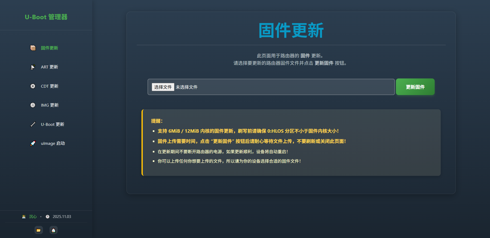

本仓库修改自：https://github.com/lgs2007m/uboot-ipq60xx-build

u-boot-2016 源代码基于：https://github.com/gl-inet/uboot-ipq60xx

**eMMC** 机型 U-Boot 仓库：https://github.com/chenxin527/uboot-ipq60xx-emmc-build

**NOR** 机型 U-Boot 仓库：https://github.com/chenxin527/uboot-ipq60xx-nor-build

## 适配设备

本项目已适配以下 IPQ60xx **NAND** 机型：

- Qihoo 360V6

> [!NOTE]
>
> 360V6 靠近 USB 的第二个网口（紧挨着 WAN 的 LAN 口）无法进入 U-Boot Web 界面，请使用其他网口。

## 编译方法

### 本地编译

1. 配置编译环境

```bash
# 编译环境：Ubuntu
# mbn 脚本使用 python3 运行，请安装并切换到 python3
sudo apt update
sudo apt install -y python3
sudo apt install -y build-essential device-tree-compiler
```

2. 克隆此仓库

```bash
git clone https://github.com/chenxin527/uboot-ipq60xx-nand-build.git
```

3. 编译你需要的设备

```bash
用法: ./build.sh [选项]

选项:
  help                    显示此帮助信息
  setup_env               仅设置编译环境
  check_file_size <文件>  检查并调整文件大小至 1536 KB (1572864 Bytes)
  clean_cache             清理编译过程中产生的缓存
  build_360v6             编译 Qihoo 360V6
  build_all               编译所有支持的设备
```

### 云编译

Fork 本仓库后使用 GitHub Actions 云编译。

## 文件说明

编译生成文件所在目录：bin/

日志文件：log-\${编译时间}.txt

U-Boot 文件：uboot-ipq60xx-nand-\${设备型号}-\${版本号}.bin

U-Boot 截图示例（[点击此处](./screenshots.md) 查看所有网页截图）：



> [!NOTE]
>
> NAND 机型的 U-Boot 均填充到了 1536 KB（0:APPSBL 分区大小）。初次刷入此 U-Boot 时建议在 SSH 下或者 TTL 下更新。其他作者的 U-Boot 可能限制了 192.168.1.1/uboot.html 界面下上传的 U-Boot 大小，无法直接更新此 U-Boot，若要在其他作者 U-Boot 的 192.168.1.1/uboot.html 界面下刷写此 U-Boot，请用十六进制编辑器删掉此 U-Boot 末尾多余的 0x0 后再尝试刷写。

## 功能介绍

### 网址说明
| 功能        | 网址                            | 备注                                |
| :---------- | :----------------------------- | :--------------------------------- |
| 更新固件     | http://192.168.1.1             | 支持 UBI 固件                      |
| 更新 ART    | http://192.168.1.1/art.html    | ART 包含路由器网卡 MAC 及无线校准数据（360V6 的 MAC 在 factory 分区）|
| 更新 CDT    | http://192.168.1.1/cdt.html    | CDT 文件不得小于 10KB（10240 Bytes） |
| 更新 IMG    | http://192.168.1.1/img.html    | 可更新 NAND 的 MIBIB 分区表或镜像 |
| 更新 U-Boot | http://192.168.1.1/uboot.html  | U-Boot 大小不能超过 1536 KB（1572864 Bytes）|
| 启动 uImage | http://192.168.1.1/uimage.html | Initramfs uImage，可直接上传至内存并启动 |

> [!NOTE]
>
> 因 U-Boot HTTP 服务器限制，不支持上传 10KB（10240 Bytes）以下的文件。若要上传的文件不足 10KB，请使用十六进制编辑器在文件末尾填充空数据（0x0），但不要超过其所在分区大小。此 U-Boot 支持上传的所有文件中，只有 CDT 文件有效数据不足 10KB，特此说明。

> [!TIP]
>
> uImage (U-Boot Image) 即所谓 “内存固件”。在 USB 9008 救砖模式下，利用 “启动 uImage” 功能可上传并启动临时 OpenWrt 固件，在临时固件中可使用预置的各种工具进行备份分区、救砖恢复等操作。
>
> [点击此处](http://example.com) 获取 USB 9008 救砖教程及相关文件。
>
> [点击此处](https://github.com/chenxin527/OWRT-BUILDS/releases?q=UIMAGE-ONLY-IPQ60XX&expanded=true) 获取经测试可正常使用的 uImage。

### 进 Web 刷机界面

所有机型都支持通过 RESET 键进入 U-Boot Web 刷机界面。

以下有 WPS 键的机型还支持通过 WPS 键进入 U-Boot Web 刷机界面：

- Qihoo 360V6

### 其他

U-Boot 下不区分 LAN / WAN，任意网口均可进入 Web 刷机界面。

按住 RESET / WPS 键后上电，等待 LED 闪烁 5 次后即可进入 U-Boot Web 刷机界面。

## 注意事项

### bootipq 失败后执行 httpd 出错

bootipq 失败后执行 httpd 会出现以下错误：

```
HTTP server is ready!

Data will be downloaded at 0x50000000 in RAM
Upgrade type: firmware
Upload file size: 57282710 bytes
Loading: #######################################
         .......................................
         #######################

done!
data abort
pc : [<4a448310>]          lr : [<4a462c0f>]
reloc pc : [<4a448310>]    lr : [<4a462c0f>]
sp : 4a27f844  ip : 000031b5     fp : 00000a01
r10: 4a487c5c  r9 : 4a27fea0     r8 : 4a487c74
r7 : 4a487c6c  r6 : 0000d250     r5 : 4a48767e  r4 : 0000ba05
r3 : 000005a6  r2 : 4a462c0f     r1 : 000005a6  r0 : 00000000
Flags: nzCv  IRQs off  FIQs off  Mode SVC_32
Resetting CPU ...
```

这是因为 bootipq 命令修改了运行环境，导致执行 httpd 命令刷写固件失败。

若遇到 bootipq 失败的情况，请断电重启路由器以重置运行环境，在 bootipq 执行前按 RESET 键重新进入 Web 界面刷写固件，或者打断 U-Boot 自动启动流程后在串口控制台手动执行相关命令。

bootipq 常见失败原因：U-Boot 无法正常读取 rootfs 分区；rootfs 分区中存储的不是正确的固件数据。
